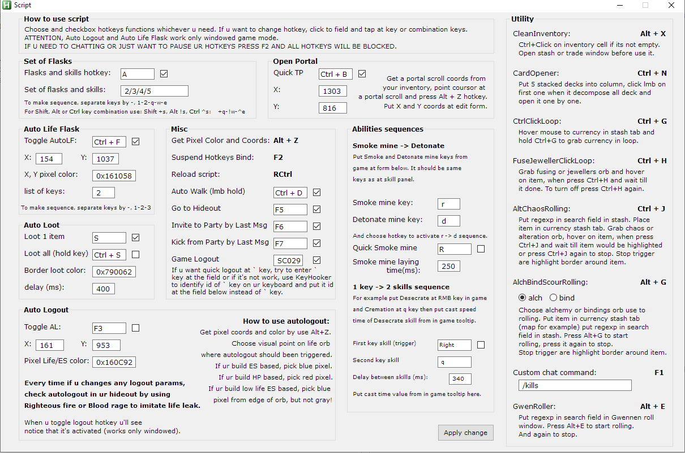

# POE_script
Set of functions for nice gameplay experience in poe.

## Requirements:
AutoHotkey v1.1.34.04

## Interface with functionality:

  

## Todo:
- Перенос и сохранение всех координат (файла settings.ini) при переключении режима экрана default/wide?
  Если default то читать/писать settings.ini если wide то settings_wide.ini.