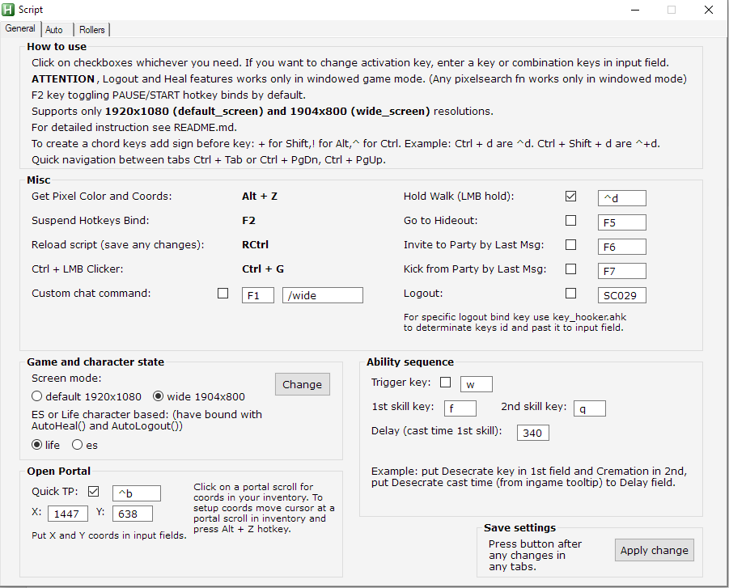
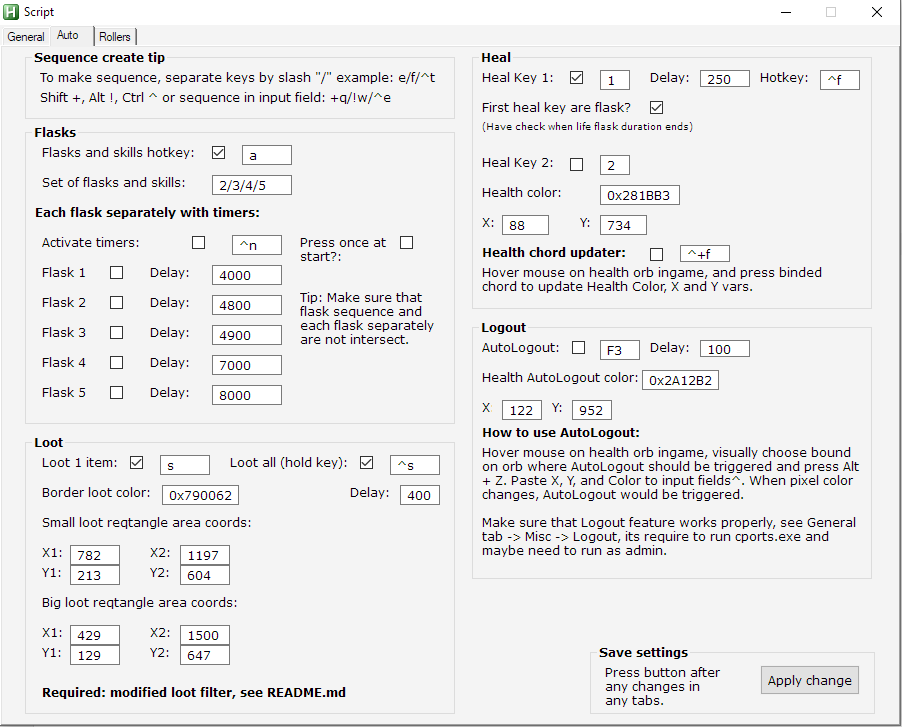
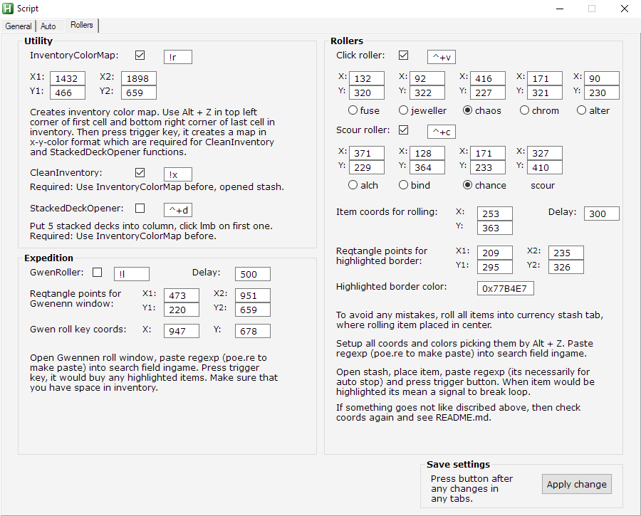

# POE_script
Set of functions for nice gameplay experience in poe.

## Requirements:
AutoHotkey v1.1.34.04

## Interface with functionality:

<h4>Interface images</h4>

  ### General tab:
  

    
  

  ### Auto tab:
  

    
  

  ### Rollers tab:
  

    
  
  

## How to use script:
- Activate checkboxes whatever you need which enable trigger keys.
  - Trigger keys (Hotkeys) can be edited in input fields.
- Symbols which should represent special keys such as: Shift are +, Ctrl are ^ and Alt are !.
  - To create a chord for example Ctrl+Shift+C add symbols before key: ^+c.
- Adjust coords in input fields with Alt + Z feature, which displays X, Y and Color of pixel under mouse cursor.
- Not supports Fullscreen mode ingame, only Windowed Fullscreen and Windowed modes.
- Only 1920x1080 and 1904x800 screen size support. For any other sizes required rewrite all coords variables.
## Features:
- General
  - Misc:
    - Get Pixel Color and Coords Alt + Z.
      - Displayes X, Y and Color of pixel under mouse cursor.
    - Logout.
      - Closes TCP/IP port which used by game.
      - Required run script as admin.
  - Game and character state:
    - Screen mode. Click on radio button to pick default or wide screen mode. Then press a Change button in its group box. Script would be reloaded and on load would read selected screen mode settings and change coords values in input fields in GUI.
    - ES or Life character based. This setting are have impact on some PixelSearch functions, so it should be selected according with character health mechanic (ES or Life).
    - Open portal. Click on portal scroll in inventory. Paste X, Y which point on portal scroll in your inventory.
  - Ability sequence:
    - Uses 2 skill in 1 key with delay (cast time of 1st skill).
- Auto
  - Flasks:
    - Can be used 1-5 flasks as 1 key.
    - Can setted timers for each flask simultaneously.
  - Loot:
    - Required modified loot filter.
    - Can loot 1 item in rectangle area per key use.
    - Can loot all items in rectangle area with holding trigger key.
    - Its searching for border loot color and click on in.
  - Heal:
    - Activates loop which checks pixel color (on health orb ingame) and if pixel was changed, clicks heal key 1 and if activated heal key 2. Delay are define frequency of PixelSearch checks. Doesn't matter are character ES or Life based. For ES heal keys can be used vaal discipline or endyring cry. When UI disappear from a screen, loop are sleeps for 500ms each time until ingame UI appears again (loading screen for example).
    - Health chord updater, grab X, Y and Color under mouse cursor and automatically input them to fields.
  - Logout:
    - Activates loop which checks pixel color (on health orb ingame) and if pixel was changed, trigger Logout(). Delay are define frequency of PixelSearch checks. When UI disappear from a screen, loop are sleeps for 500ms each time until ingame UI appears again (loading screen for example).
- Rollers
  - Utility:
    - InventoryColorMap. Creates inventory color map, with X-Y-Color of each inventory cell. Required for CleanInventory() and StackedDeckOpener().
    - CleanInventory. Required InventoryColorMap() before use. Automatically Ctrl + LMB on each cell in inventory if it not empty. Its defines empty cell or not which are recorded in inv_coords variable.
    - StackedDeckOpener. Required InventoryColorMap() before use. Sequentially opens card decks. 
  - Expedition:
    - GwenRoller. Ctrl + LMB on each item which was highlighted in Gwennen roll window. If no highlighted items were found then clicks on roll key button. Be aware of inventory empty space.
  - Rollers:
    - Click roller. Grab selected currency and click it in loop on item coords for rolling. It stops with repeat press trigger key or on appear highlighted border. Required inputed reqtangle points for highlighted border and border color. Paste regexp (poe.re) in search field ingame to create a condition to trigger auto stop.
    - Scour roller. Sequentially clicks on selected currency (alch, bind, chance orb) and scoure orb until press trigger key again or on appear highlighted border. Paste regexp (poe.re) in search field ingame to create a condition to trigger auto stop.
